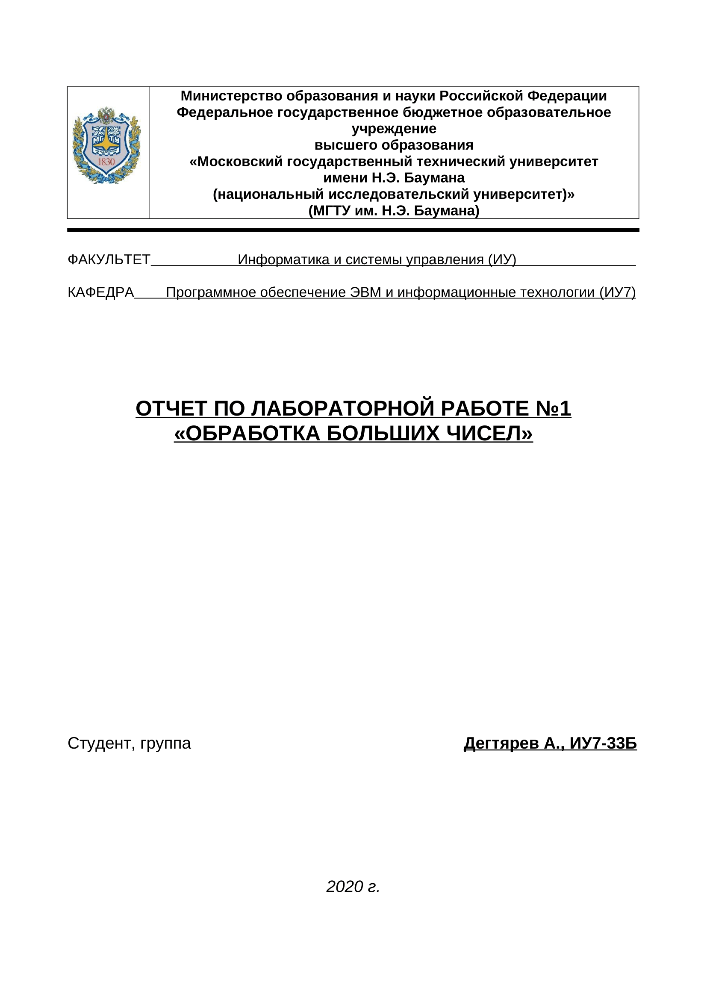

## Условие задачи
tnikulshina@bmstu.ru
Смоделировать операцию деления действительного числа в форме `±m.nЕ±K`, где суммарная длина мантиссы (m+n) - до 30 десятичных цифр, а величина порядка K - до 5 цифр, на целое число длиной до 30 десятичных цифр. Результат выдать в форме `±0.m1Е±K1`, где m1 - до 30 значащих цифр, а K1 - до 5 цифр.

## Техническое задание

### Задача, реализуемая программой

Считывание действительного и целого числа через консольный пользовательский интерфейс, их деление и вывод результата.

### Исходные данные

1. Строка с действительным числом в форме `±m.nЕ±K` где суммарная длина мантиссы (m+n) - от 1 до 30 десятичных цифр, а величина порядка K - до 5 цифр. Порбелы в начале и конце строки игнорируются, но внутри числа недопустимы. `0` в начале и конце учитывается в длине мантиссы. Знак `+` в мантиссе и порядке может быть опущен. Символа `.` может не быть. При наличии `.`, m или n может быть пустым. Мантисса и порядок разделяются симоволом `E` или `e`. Сразу после разделителя всегда идет не пустой порядок. Порядок может быть опущен. Другие символы недопустимы
2. Строка с целым числом в форме `±N` где длина N от 1 до 30 десятичных цифр. Аналогично действительному числу пробелы в начале и конце строки игнорируются, `0` в начале учитывается в длине и знак `+` может быть опущен.

### Результат

Строка с действительным числом - результатом деления действительного числом на целое - в форме `±0.m1Е±K1`, где m1 - от 1 до 30 десятичных цифр, а K1 - от 1 до 5 цифр.

### Способ обращения к программе

1. Код программы компилируется с помощью скрипта `compile.sh <имя файла>`. Если `имя файла` не указано, приложение будет сохранено в `lab1`.
2. Программа запускается через консоль без параметров.

### Аварийные ситуации

1. Неправильный ввод. Ввод чисел должен соотвествовать формату исходных данных.
   - Вещественного числа.
   - Целого числа.
2. Ошибка деления на 0
3. Ошибка переполнения порядка результата

## Cтруктуры данных

```c
#define MANTISSA_LEN 30 // количество цифр в мантиссе.

typedef signed char t_digit; // тип цифры. хранит не символ, а число

typedef struct
{
    signed char sign; // знак числа
    int point; // индекс цифры, перед которой стоит точка
    int exponent; // экспонента
    t_digit digits[MANTISSA_LEN]; // массив цифр
} t_decimal;
```

Во время деления использются отдельные массивы цифр удвоенного размера.

## Алгоритм

Сначало идет чтение чисел из консоли, затем деление. Деление происходит классическим делением "уголком". Вычитание знаменателя, умноженного на наибольшую цифру, заменено последовательным вычитанием знаменателя.

### Чтение

1. Посимвольно считываем числа из консоли.

  - если появляется недопустимый символ выводим сообщение об ошибке. Завершаем программу.

### Деление

1. Проверяем является ли знаменатель нулём.

  - если является, выводим сообщение об ошибке. Завершаем программу.

2. Копируем цифры числитель во временный массив размером `MANTISSA_LEN * 2`, вторая половина которого будет накапливать вычитания для дальнейшего округления.

3. Сравниваем массивы цифр числителя и знаменателя

  - если числитель больше либо равен знаменателю, то вычитаем знаменатель, увеличиваем цифру частного
  - если числитель меньше знаменателя, то сдвигаем массив знаменателя на одну цифру в право, для расчета следующей цифры частного

4. Повторять 3\. пока все цифры частного + 1 не определятся

5. Округлить результат, отбросив последнюю цифру.

6. Расчитать экспоненту и знак частного.
  - если произошло переполнение, вывести ошибку.

## Тесты

| Описание                         | Ввод                           | Вывод               |
| -------------------------------- | ------------------------------ | ------------------- |
| деление 2 единиц                 | `1`<br>`1`                     | `+0.1E+1`           |
| ввод букв в числитель            | `1a`<br>`1`                    | ошибка ввода        |
| ввод букв в знаменатель          | `1`<br>`1a`                    | ошибка ввода        |
| ввод. пробелы в начале           | `__1`<br>`__1`                 | `+0.1E+1`           |
| ввод. пробелы в конце            | `1__`<br>`1__`                 | `+0.1E+1`           |
| деление 2 целых числитель больше | `42`<br>`2`                    | `+0.21E+2`          |
| деление 2 целых числитель меньше | `21`<br>`42`                   | `+0.5E+0`           |
| деление на 0                     | `42`<br>`0`                    | ошибка дел.         |
| деление 0 на целое               | `0`<br>`5`                     | `+0.0E+0`           |
| ввод числителя с минусом         | `-6`<br>`2`                    | `-0.3E+1`           |
| ввод числителя с плюсом          | `+6`<br>`2`                    | `+0.3E+1`           |
| ввод знаменталя с минусом        | `6`<br>`-2`                    | `-0.3E+1`           |
| ввод знаменталя с плюсом         | `6`<br>`+2`                    | `+0.3E+1`           |
| деления отриц. числ. и знам.     | `-6`<br>`-2`                   | `+0.3E+1`           |
| ввод числителя с .               | `40.`<br>`2`                   | `+0.2E+2`           |
| ввод числителя с .0              | `40.0`<br>`2`                  | `+0.2E+2`           |
| ввод знаменталя с .0             | `40`<br>`2.0`                  | ошибка ввода        |
| ввод с точкой и знаком           | `-6.0`<br>`3`                  | `-0.2E+1`           |
| ввод 0. в начале вещественного   | `0.8`<br>`4`                   | `+0.2E+0`           |
| ввод . в начале вещественного    | `.8`<br>`4`                    | `+0.2E+0`           |
| ввод точки без цифр              | `.`<br>`3`                     | ошибка ввода        |
| ввод 0 в начале вещественного    | `000.8`<br>`2`                 | `+0.4E+0`           |
| ввод 29 0-ей в начале вещ. числа | `<0 29 раз>.8`<br>`2`          | `+0.4E+0`           |
| ввод 29 0-ей в начале вещ. числа | `<0 30 раз>.8`<br>`2`          | ошибка ввода        |
| ввод 0 в начале целого           | `0.8`<br>`002`                 | `+0.4E+0`           |
| ввод 29 0-ей в начале целого     | `0.8`<br>`<0 29 раз>2`         | `+0.4E+0`           |
| ввод 30 0-ей в начале целого     | `0.8`<br>`<0 30 раз>2`         | ошибка ввода        |
| ввод 0 после .                   | `0.008`<br>`2`                 | `+0.4E-2`           |
| ввод 29 цифр после 0.            | `0.<0 28 раз>8`<br>`2`         | `+0.4E-28`          |
| ввод 30 цифр после 0.            | `0.<0 29 раз>8`<br>`2`         | ошибка ввода        |
| ввод 29 0-ей после точки         | `8.<0 29 раз>`<br>`2`          | `+0.4E+1`           |
| ввод 30 0-ей после точки         | `8.<0 30 раз>`<br>`2`          | ошибка ввода        |
| ввод 30 цифр после .             | `.<0 29 раз>8`<br>`2`          | `+0.4E-29`          |
| ввод 31 цифр после .             | `.<0 30 раз>8`<br>`2`          | ошибка ввода        |
| ввод 30 цифр в числителе         | `9<0 29 раз>`<br>`3`           | `+0.3E+30`          |
| ввод 31 цифра в числителе        | `9<0 30 раз>`<br>`3`           | ошибка ввода        |
| ввод 30 цифр в знаменателе       | `9`<br>`3<0 29 раз>`           | `+0.3E-28`          |
| ввод 31 цифра в знаменателе      | `9`<br>`3<0 30 раз>`           | ошибка ввода        |
| деление 30 цифр в числ. и знам.  | `9<0 29 раз>`<br>`3<0 29 раз>` | `+0.3E+1`           |
| ввод числителя с экспонентой     | `9E10`<br>`3`                  | `+0.3E+11`          |
| ввод числителя с малой эксп.     | `9e10`<br>`3`                  | `+0.3E+11`          |
| ввод числителя с эксп. без цифр  | `9E`<br>`3`                    | ошибка ввода        |
| ввод знаменталя с экспонентой    | `9`<br>`3E10`                  | ошибка ввода        |
| ввод экспоненты с плюсом         | `9E+10`<br>`3`                 | `+0.3E+11`          |
| ввод экспоненты с -              | `9E-10`<br>`3`                 | `+0.3E-9`           |
| ввод экспоненты с буквой         | `9Ea`<br>`3`                   | ошибка ввода        |
| ввод экспоненты с пробелом перед | `9 E10`<br>`3`                 | ошибка ввода        |
| ввод экспоненты с пробелом после | `9E 10`<br>`3`                 | ошибка ввода        |
| ввод точки перед экспонентой     | `9.E10`<br>`3`                 | `+0.3E+11`          |
| ввод макс. эксп. в норм. виде    | `.1E99999`<br>`1`              | `+0.1E+99999`       |
| деления макс. экс. с умен. эксп. | `1E99999`<br>`10`              | `+0.1E+99999`       |
| деления макс. экс. с сохр. эксп. | `1E99999`<br>`1`               | ошибка переполн.    |
| деления макс. экс. с увел. эксп. | `0.1E-99999`<br>`10`           | ошибка переполн.    |
| деления с получением периода     | `1`<br>`3`                     | `+0.<3 30 раз>E+0`  |
| деления с округлением            | `2`<br>`3`                     | `+0.<6 29 раз>7E+0` |
| деление с переносом округления   | `<9 19 раз>`<br>`<9 20 раз>`   | `+0.<9 19 раз>1E+0` |

## Функции
```c
// src/main.c
/*
  Выводит в консоль приветственное сообщение c описанием программы
*/
void print_hello();

/*
  Выводит в консоль линейку в 30 символов
*/
void print_ruler();

// src/decimal/main.h
/*
  Записывает в val 0
*/
void set_zero_decimal(t_decimal *val);

// src/decimal/io.h
/*
  Считывает из консоли целое
*/
int scanf_decimal_int(t_decimal *val);
/*
  Считывает из консоли вещественное число
*/
int scanf_decimal_float(t_decimal *val);
/*
  Записывает в консоль val как целое число
*/
void print_decimal_int(const t_decimal *val);
/*
  Записывает в консоль val как вещественное число
*/
void print_decimal_float(const t_decimal *val);

// src/decimal/division.h
/*
  Делит числа.
  Результат записывается в нормализованном виде в quotient.
  Возвращает OK или ERR если произошла ошибка
*/
int divide_decimal(
    const t_decimal *dividend,
    const t_decimal *divider,
    t_decimal *quotient
);

// src/decimal/division.c
/*
   Считает количество нулей в начале массива цифр.
*/
int get_start_zeros_number(const t_digit *arr);
```

## Вывод

  В данной лабораторной работе было изучено представление чисел, выходящими за
разрядную сетку компьютера, а также арифметичские операции над ними. Было
запрограммировано считывание и вывод длинных чисел, операция деления вещественного
числа на целое. Таким образом, при необходимости программа может обрабатывать
числа любой точности, в не зависимости от устройства, запускающего эту программу.

## Ответы на контрольные вопросы

### Каков возможный диапазон чисел, представляемых в ПК?

-  Целые положительные: `0 <= x <= 2^n - 1`  
   Целые положительные и отрицательные: `-2^(n-1) <= x <= 2^(n-1) - 1`  
   для `n`-разрядной машины
-  Действительные: `3.6E-4951 <= x <= 1.1E+4932`где размер мантиссы 52 двоичных разряда а порядок 11 двоичных разрядов

### Какова возможная точность представления чисел, чем она определяется?

В 64-битных машинах - 20 десятичных знаков после запятой. Определяется длиной мантиссы.

### Какие стандартные операции возможны над числами?

Сложение, вычитание, умножение, деление, сравнение.

### Какой тип данных может выбрать программист, если обрабатываемые числа превышают возможный диапазон представления чисел в ПК?

Можно хранить массив цифр. Можно реализовать обработку чисел, аналогичную машинному представлению.

### Как можно осуществить операции над числами, выходящими за рамки машинного представления?

Операции над числами можно осуществить, используя классические методы вычислений, например, умножение "столбиком", деление "уголком", работающие с массивом цифр. Можно использовать приблеженные методы, например, Ньютона-Рафсона, которые быстрее, но менее точные и более сложные в реализации.
